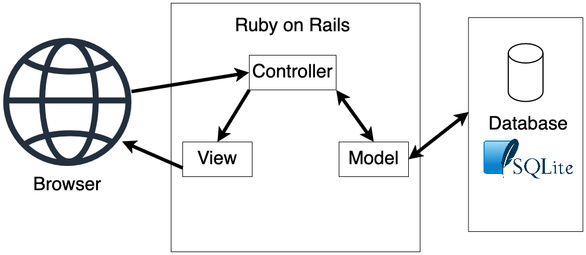

# COMP 4350 Proposal - Second Team

### Group members:

- Caelan Myskiw (Leader)
- Cole Chuchmach
- Michael Walld
- Niko Christie
- Owen Zonneveld

## Project summary and vision

Our project vision is to create an online “casino” website. This website will allow users to play casino games using an online currency (no real cash equivalent). The currency will be able to be used across all different games with users being able to use their username to save a profile that maintains a persistent currency amount.  Additionally, to create an increased sense of community and realism we will have a global chat feature which allows users to talk amongst themselves.

The stakeholders of our project are us (the dev team)

## Core features

1. Manage an account, be able to create an account using a simple Username and then login using that same account. This would store stats related to player and the games they’ve played.

2. Ability to switch between casino games via a lobby system.

3. Chat system with global chat when in the main lobby, and individual chats when in the specific games (horse racing, roulette, blackjack)

4. Horse racing will select a fixed number of horses with chances of winning adding up to 1, the horses with lower % will offer higher payout.

5. Roulette will have a grace period for users to bet on specific numbers or colours and then will spin after the period ends

6. Blackjack will be playing with a deck against 3-4 players concurrently. Each player will have a certain amount of time (15s) to decide before going on to each player. After all players have gone the AI will flip their card and draw until 17 or bust.

## Technologies

- Ruby on rails
- SQLite

## User stories

As a user I want to be able to login with a username (persistent data)

As a user I want to save my current currency amount between sessions. (persistent data)

As a user I want to be able to enjoy playing the slot machine. (slot machine)

As a user I want to be able to switch between multiple games in one session. (switch between games)

As a user I want to be able to chat with other users currently playing in the casino (chat feature)

As a user I want to be able to play a game with other users at the same time (concurrent gaming)

As a user I want to be able to play blackjack (concurrent gaming)

## Block Diagram:

